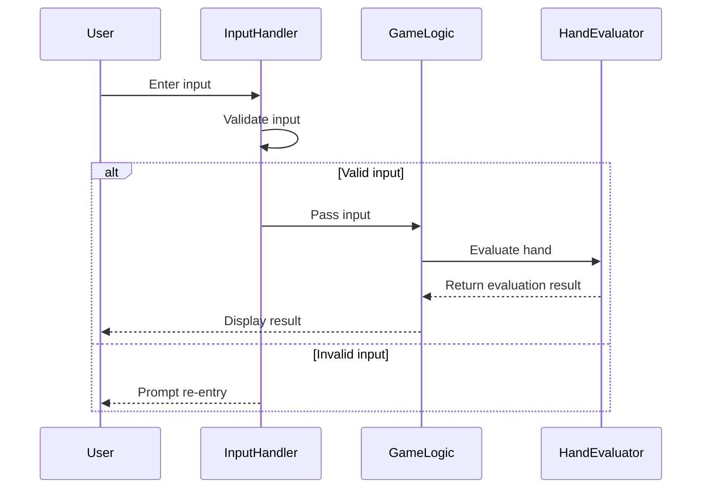

# Simple Poker

このプログラムは、ドメイン駆動設計（DDD）で構築されたシンプルなポーカーゲームです。ユーザーはデッキからカードを引き、手札を入れ替えて役を確認できます。

## 主な特徴

- **ドメイン駆動設計（DDD）**：ドメインモデル、リポジトリ、サービス、ユースケース、インフラ、プレゼンテーション層で構成
- **役判定**：ロイヤルストレートフラッシュ等、主要な役を判定
- **CLIインターフェース**：コマンドラインでプレイ可能

## ディレクトリ構成

```
simple-poker/
├── src/
│   ├── domain/        # ドメイン層（model, service, repository）
│   ├── application/   # ユースケース層
│   ├── infrastructure/# インフラ層（リポジトリ実装など）
│   ├── presentation/  # プレゼンテーション層（CLI）
│   └── main.rs        # エントリポイント
├── tests/             
├── README.md
├── design-doc.md
└── ...
```

## 機能一覧
- デッキ生成・シャッフル
- カード配布・手札管理
- 役判定（ロイヤルストレートフラッシュ等）
- プレイヤー管理・ベット・フォールド
- ゲーム進行（ターン制・ラウンド制）
- CLIによる操作

## テスト
- ドメインモデルの不変条件・エッジケースを網羅
- テスト関数名・コメント・アサートはすべて日本語
- `cargo test`で全テストが成功

## 実行方法

Rustがインストールされている環境で以下を実行：

```bash
cargo run
```

## 開発方針・今後の展望
- DDDの原則に則った拡張性・保守性重視
- テスト駆動・品質重視
- 今後はマルチプレイヤー、AI、Web UI、履歴保存なども拡張予定


