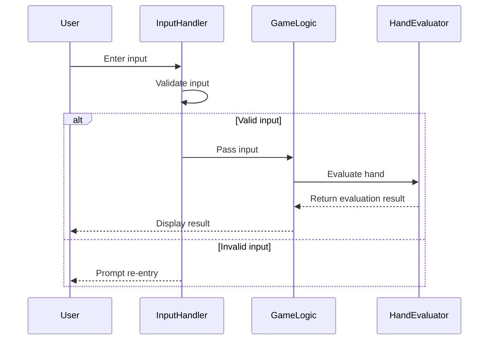

# Simple Poker

このプログラムは、簡単なポーカーゲームをシミュレートします。ユーザーはデッキからカードを引き、手札を入れ替えて役を確認することができます。

## 機能

- **デッキの生成**: 52枚のカードからなるデッキを生成します。
- **シャッフル**: デッキをランダムにシャッフルします。
- **カードを引く**: デッキから5枚のカードを引き、手札を形成します。
- **手札の入れ替え**: ユーザーは手札のカードを選んでデッキから新しいカードと入れ替えることができます。
- **役の判定**: 手札の役を判定し、以下の役の有無を表示します：
  - ロイヤルストレートフラッシュ
  - ストレートフラッシュ
  - フォーカード
  - フルハウス
  - フラッシュ
  - ストレート
  - スリーカード
  - ツーペア
  - ワンペア

## 使用方法

1. プログラムを実行すると、デッキから5枚のカードが引かれ、手札が表示されます。
2. 入れ替えたいカードの番号をスペースで区切って入力します（例: `1 2 3`）。
3. 無効な入力（範囲外の数字など）の場合は、再入力を求められます。
4. 入力後、新しい手札が表示され、役が判定されます。

## 役の判定（強い順）

1. **ロイヤルストレートフラッシュ**: 同じスートの10, J, Q, K, A
2. **ストレートフラッシュ**: 同じスートの連続した5枚のカード
3. **フォーカード**: 同じランクのカードが4枚
4. **フルハウス**: 3枚組1つと2枚組1つの組み合わせ
5. **フラッシュ**: 全てのカードが同じスート
6. **ストレート**: 連続した5枚のカード（A-5の最低ストレートを含む）
7. **スリーカード**: 同じランクのカードが3枚
8. **ツーペア**: 2つのペア
9. **ワンペア**: 1つのペア
10. **ハイカード**: 上記の役が一つもない場合（最も高いカードで判定）

## エラーハンドリング

- 範囲外の数字が入力された場合は、適切なエラーメッセージを表示し再入力を求めます
- 無効な入力（数字以外の文字など）は自動的にフィルタリングされます

## 必要なライブラリ

- `rand`: デッキをシャッフルするために使用
- `std::collections::HashMap`: 役の判定に使用

## 実行方法

Rustがインストールされている環境で以下のコマンドを実行してください：

```bash
cargo run
```

このプログラムは、Rustの基本的な構文と標準ライブラリの使用方法を学ぶのに役立ちます。また、エラーハンドリングやコレクションの使用方法についても良い例となっています。楽しんでください！


